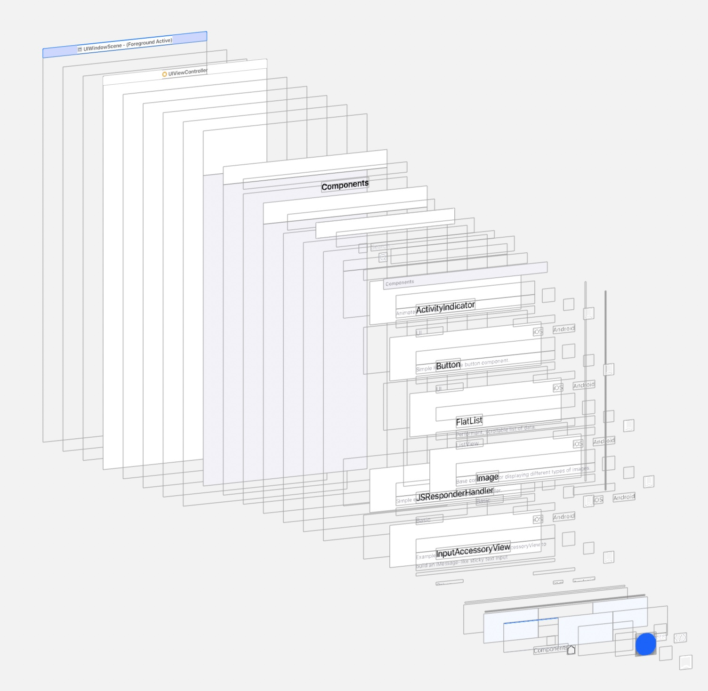
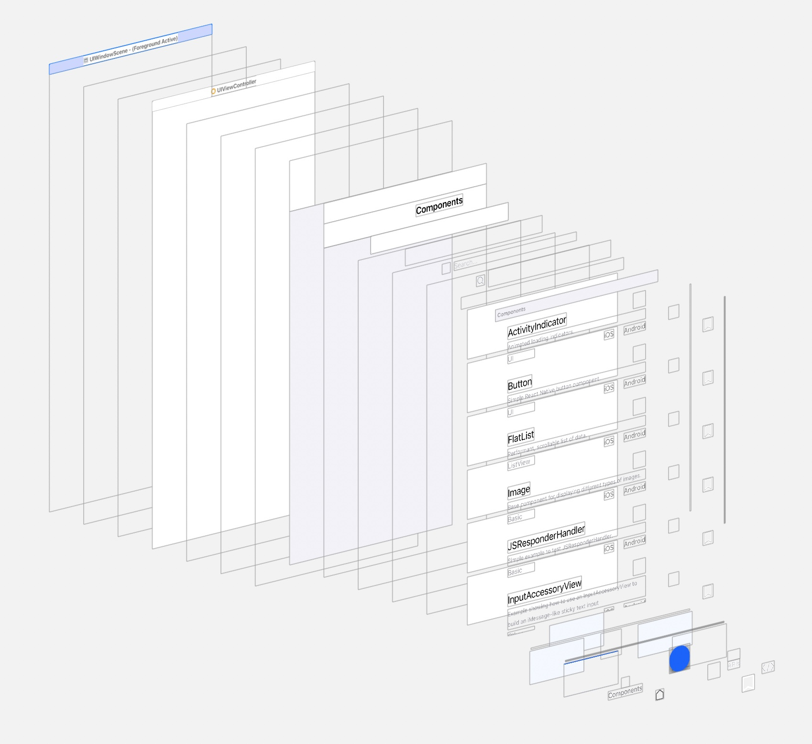

# View Flattening on iOS

View Flattening on iOS is an optimisation by the new React Native renderer to avoid deep layout trees.

The React API is designed to be declarative and reusable through composition. This is great for 
intuitive development but it leads to deep [React Element Trees](https://reactnative.dev/architecture/glossary#react-element-tree-and-react-element) 
where component affect the layout but don’t paint anything on the screen. 
We call these types of components *Layout-Only*. Flatter view hierarchy has lower memory usage and faster drawing times.

Some requirements for a component to be *Layout-Only*:
- Pure `<View />`, not a subclass.
- No event listeners.
- [nativeID](https://reactnative.dev/docs/view#nativeid) is not defined.
- Is not accessible element.
- Full opacity.
- No background colour.
- [Rest of the requirements](https://github.com/facebook/react-native/blob/main/ReactCommon/react/renderer/components/view/ViewShadowNode.cpp#L45-L67)

## Common sources of *Layout-Only* components

### Adding padding/margin to components

Let's take an example of component that shows image with a title and call it [ImageWithTitle](./AwesomeApp/ImageWithTitle.tsx). 
We would like to add some space between the component and the surrounding content.

```jsx
function ImageWithTitle(props) {
    return (
        <View style={{padding: 10}}>
            <Image source={{uri: props.image}} />
            <Text>{props.title}</Text>
        </View>
    );
}
```

The top most `<View />`, which adds padding, doesn't paint anything to the screen. If we delete [host view](https://reactnative.dev/architecture/glossary#host-view-tree-and-host-view) representing the top most `<View />`, it will not affect what is drawn on the screen. Framework applies padding to its children to make sure they are correctly positioned on the screen.

### Components in a row
A common requirement is to place elements in a row or column. 
For this example, we want to display names of two people with company name under the name, [NameList](./AwesomeApp/NameList.tsx).
To group person's name with company name, it has to be wrapped in a `<View />` component to create new flex container.

```JSX
<View style={{flexDirection:'row'}}>
    <View>
        <Text>Alice</Text>
        <Text>Company A</Text>
    </View>
    <View>
        <Text>Bob</Text>
        <Text>Company B</Text>
    </View>
</View>
```

There are three `<View />` components. One is setting `flexDirection: row` and the other two group components into separate flex containers. 
Neither of them paint anything to the screen. 

## Positioning components in a flat list item

For a more complex example, we are going to build an item in a flat list showing movie screening details. 
The component, called [MovieDetails](./AwesomeApp/MovieDetails.tsx), will display name, genre, thumbnail, place and time of a screening. 

<details>
  <summary>MovieDetails component</summary>

```jsx
import React from 'react';
import {SafeAreaView, StyleSheet, Text, View, Image} from 'react-native';

function Movie(props) {
  return (
    <View style={styles.wrapper}>
      <View style={styles.movieInfo}>
        <View style={styles.thumbnail} />
        <View style={styles.movieNameAndGenre}>
          <Text>{props.title}</Text>
          <Text style={styles.subtitle}>{props.genre}</Text>
        </View>
      </View>
      <View style={styles.eventInfo}>
        <Text>{props.time}</Text>
        <Text>{props.place}</Text>
      </View>
    </View>
  );
}

const styles = StyleSheet.create({
    wrapper: { 
        padding: 10, 
        flexDirection: 'row', 
        alignItems: 'center',
    },
    subtitle: {
        color: 'grey',
    },
    movieNameAndGenre: {
        marginLeft: 10,
    },
    thumbnail: {
        width: 60,
        height: 60,
        backgroundColor: 'blue',
    },
    eventInfo: {
        marginLeft: 'auto',
    },
    movieInfo: {
        flexDirection: 'row', 
        alignItems:'center', 
    }
});
```
</details>

The following screenshot show what view hierarchy is painted without flattening. All views have red border to
make "Layout-Only" components visible.


The second screenshot shows what view hierarchy is painted with with flattening enabled. Four *Layout-Only* views were removed without affecting visual appearance.


## RNTester

Here are screenshots of what the view hierarchy looks like in [RNTester](https://github.com/facebook/react-native/tree/main/packages/rn-tester) with and without view flattening.
This is closer to a real world app.

View hierarchy without flattening.


View hierarchy with flattening.

